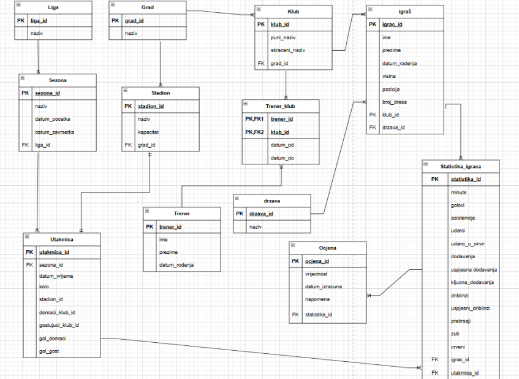

# hnl-performance-metrics
Sustav za praćenje i ocjenjivanje igrača HNL-a temeljen na relacijskoj bazi podataka. Projekt uključuje ERA model, SQL upite, triggere i jednostavno korisničko sučelje.

# Sustav za praćenje i ocjenjivanje igrača HNL-a

Projekt sustava baze podataka za upravljanje i analizu performansi nogometaša u Hrvatskoj nogometnoj ligi (HNL). Razvijeno u sklopu kolegija **Baze podataka 2** (FOI).

## ER Dijagram sustava

## 🚀 O projektu
Glavni cilj sustava je automatizacija izračuna ocjena igrača na temelju njihovog učinka na terenu. 

### Ključne tehničke značajke:
* **SQL Trigeri:** Automatski izračun i ažuriranje prosječne ocjene igrača pri svakom unosu nove statistike.
* **Stored Procedures:** Procedure za siguran unos podataka i dohvaćanje kompleksnih izvještaja.
* **Relacijski model:** Detaljno razrađene veze između klubova, igrača i odigranih utakmica.

## Izgled sučelja

